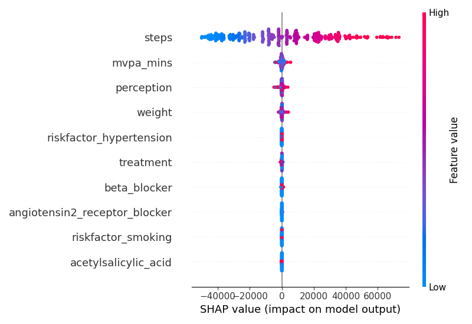

# 🧠 ML Prediction of Physical Activity Goals

> An end-to-end machine learning project to predict **Steps Goal** and **MVPA Minutes Goal** using multiple regression models, advanced preprocessing, and SHAP explainability.

---

## 📌 Project Description

This project aims to develop predictive models for:
- 🎯 **Daily Steps Goal**
- 🕒 **MVPA (Moderate to Vigorous Physical Activity) Minutes Goal**

It uses structured health and activity data to build, evaluate, and interpret ML models with full transparency and reproducibility.

---
### feature importance



## 🗂️ Project Structure

```bash
.
├── data/
│   ├── DummyData.xlsx
│   ├── DummyData.csv
│   ├── feature_importance_steps_goal.csv
│   └── feature_importance_mvpa_mins_goal.csv
├── photo/
│   ├── correlation_matrix.png
│   ├── r2_comparison.png
│   ├── shap_feature_importance_steps_goal.png
│   └── shap_feature_importance_mvpa_mins_goal.png
├── models/
│   ├── xgb_steps_model.joblib
│   └── xgb_mvpa_model.joblib
├── notebooks/
│   └── final_model_notebook.ipynb
└── README.md
