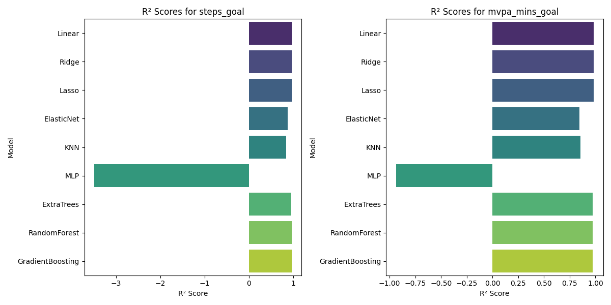
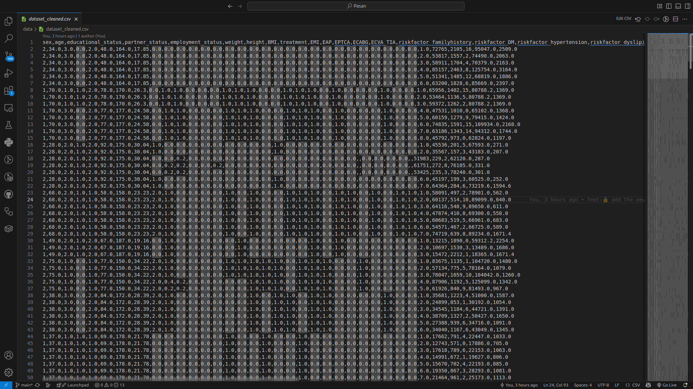

# Machine Learning
- prediction and fit the molde ML like:
- LinearRegression
- Ridge
- Lasso
- ElasticNet
- KNeighborsRegressor
- MLPRegressor
- ExtraTreesRegressor
- RandomForestRegressor
- GradientBoostingRegressor
- XGBRegressor


## Technology Stack and Features
- 🤖 [**ML**]
    - 📊 [LinearRegression]
    - 🌐 [Ridge]
    - 📡 [Lasso]
    - 🐋 [XGBRegressor]
- ⚡ [**FastAPI**]
    - 🧰 [SQLModel](https://sqlmodel.tiangolo.com) for the Python SQL database interactions (ORM).
    - 🔍 [Pydantic](https://docs.pydantic.dev), used by FastAPI, for the data validation and settings management.
    - 💾 [PostgreSQL](https://www.postgresql.org) as the SQL database.


### R2 model




### data




## Local Development with Poetry:

[check this page](backend/README.md).

## Dockerized Deployment:

Create an **.env** file on root folder and copy the content from **.env.example**. Feel free to change it according to your own configuration.

## Development guide:

### Run the project using Docker containers and forcing build containers

###  Project structure description:
**docker-compose-dev.yml**: a container for the PostgreSQL and Redis services
- When you want to build the project you should use this file to have dockerized postgres and redis attached to the project.
- To build and run PostgreSQL and Redis should use this command: 
```dockerfile
docker-compose --build 
```
#### Hint:
If you get some errors like 'port already in use' for postgres or redis you can change the external port.

**docker-compose.yml**:
- Main Docker-Compose file for building the service.For running a container after  building PostgreSQL and Redis 
You should run the following command : 
```dockerfile
docker-compose up -d --build
```


## TODO List:
- [x] Add Custom Exception handler
- [ ] Add a JSONB field on the table sample
- [x] Add docstrings
- [x] Add Custom Response model
- [ ] Create a sample one-to-many relationship
- [ ] Create a sample many-to-many relationship
- [x] Add Black formatter and flake8 lint
- [ ] Add export report api in CSV/XLSX files using StreamingResponse
- [ ] Convert repo into template using cookiecutter
- [ ] Add tests for APIs

